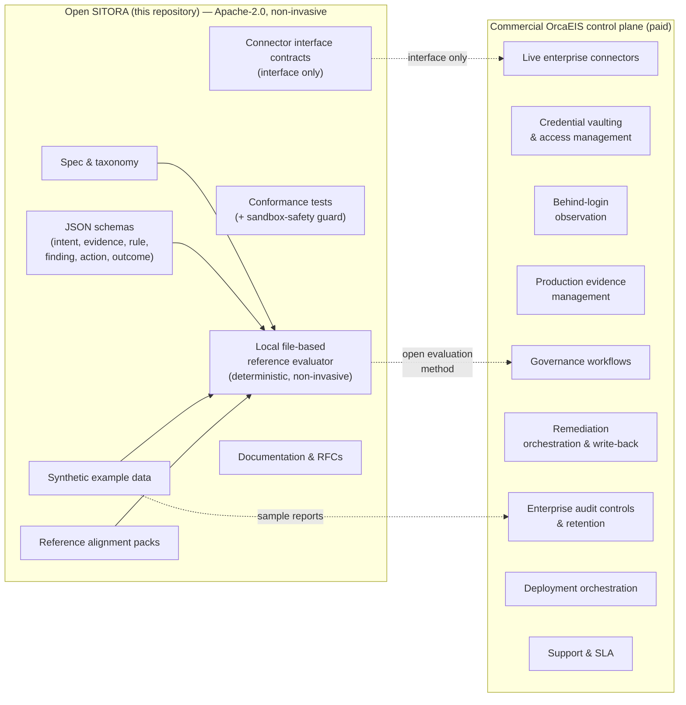

# SITORA Open-Core Architecture

This diagram distinguishes what is open in the SITORA repository from what is
delivered commercially by the OrcaEIS enterprise control plane.

## Boundary

### Open side (controlled evaluation)

Local file-based evaluator, schemas, synthetic data, reference alignment packs,
conformance tests, and the sandbox-safety guard. Non-invasive: reads local
files, writes only to an explicit output path, no network, no credentials, no
write-back. A buyer can run this in any controlled environment they choose —
a laptop, VM, offline container, secure folder, or formal sandbox (see
[SANDBOX.md](../SANDBOX.md)).

### Commercial side (production integration)

Live enterprise connectors, credential vaulting, behind-login observation,
governance workflows, production evidence management, remediation
orchestration and write-back, enterprise audit controls, and deployment.

## Rule

> If it helps people understand, model, test, or extend alignment, it can be
> open. If it handles enterprise credentials, sensitive evidence,
> organizational governance, operational deployment, or scalable remediation,
> it belongs in OrcaEIS.

See [COMMERCIAL_BOUNDARY.md](../COMMERCIAL_BOUNDARY.md) for the full matrix.
